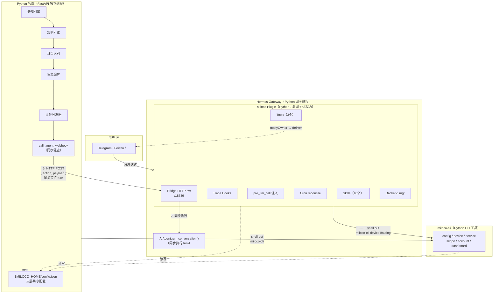
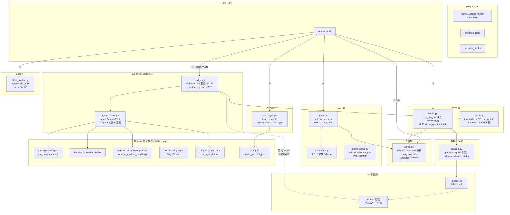
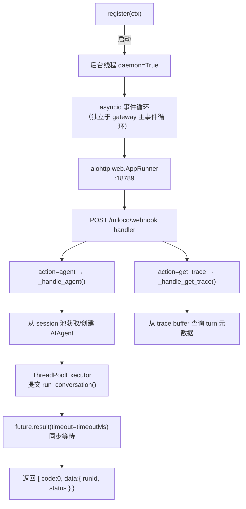

# Hermes Agent 插件设计文档

> 本文档详尽描述 Miloco Hermes Agent 插件 (`plugins/hermes/`) 的技术设计，作为 OpenClaw 插件 (`plugins/openclaw/`) 的平行实现，复用相同的 Python 后端 (`backend/`) 和 `miloco-cli` (`cli/`)。

---

## 1. 架构总览

### 1.1 三层架构



### 1.2 设计原则

| 原则 | 说明 |
|------|------|
| **薄适配层** | 插件只做上下文注入、工具注册、webhook 转发、cron 调度；重计算在后端 |
| **Shell out 到 miloco-cli** | 设备目录、后端管理都调 CLI，与 OpenClaw 插件一致 |
| **直接 import AIAgent** | webhook bridge 直接构造 `AIAgent` 并同步运行 turn（cron 模式） |
| **共享 config.json** | 三层读写 `$MILOCO_HOME/config.json`，保持一致性 |
| **后端零改动** | webhook bridge 实现与 OpenClaw 相同的 `{ action, payload }` 协议和 `{ code, message, data }` 响应格式，后端无需修改 |

### 1.2.1 插件模块架构



**模块依赖说明**：

| 模块 | 职责 | 依赖 |
|------|------|------|
| `config.py` | `$MILOCO_HOME` 路径解析、共享 config.json 读写、插件配置 Schema | `hermes_constants`（`get_hermes_home`） |
| `bridge.py` | 自建 aiohttp HTTP 服务，接收后端 `{ action, payload }` POST，实现固定契约 | `agent_runner`、`trace` |
| `agent_runner.py` | `AgentSessionPool`：按 session_key 缓存/复用 `AIAgent` 实例，`ThreadPoolExecutor` 同步执行 turn | `run_agent.AIAgent`、`hermes_state.SessionDB`、`runtime_provider`、`plugin_utils.lazy_singleton` |
| `hooks.py` | `pre_llm_call` 回调：Profile 分级判定 + 上下文文本组装（指令块 + 数据块） | `config`、`catalog`、`suggestions` |
| `trace.py` | turn trace 内存 buffer、GC 策略、debug gzip 落盘、`get_trace` 查询 | `config`（`miloco_home`） |
| `schemas.py` | 3 个工具的 OpenAI function-calling JSON Schema 定义 | 无 |
| `tools.py` | `miloco_im_push` / `miloco_notify_bind` handler 实现 | `schemas`、`config` |
| `suggestions.py` | `miloco_habit_suggest` 防骚扰状态机（`threading.Lock` + 原子写） | `config`（路径） |
| `catalog.py` | 设备目录获取（`miloco-cli device catalog`，5s 节流） | `miloco-cli`（shell） |
| `cron_sync.py` | 4 个 cron job 的 reconcile + CLI 命令 `hermes miloco` | `cron.jobs` |
| `skills_loader.py` | 16 个 skill 的 `ctx.register_skill()` 注册 | `plugins/skills/` 源目录 |

### 1.2.2 Webhook 契约：后端固定调用格式

**关键事实**：webhook 的请求/响应协议是后端 `agent_client.py` 中**硬编码的固定契约**，不可通过配置改变。插件实现方（OpenClaw 或 Hermes）必须逐字段兼容这个协议。

**配置项**（存在 `$MILOCO_HOME/config.json` → `agent` 对象）：

| 字段 | 默认值 | 说明 |
|------|--------|------|
| `agent.webhook_url` | `http://127.0.0.1:18789/miloco/webhook` | 后端 POST 的目标 URL |
| `agent.auth_bearer` | `""` | `Authorization: Bearer <值>` 头；空则不发 |

**谁写入这些值**：
- OpenClaw 插件在 `loadSharedConfig()` 时自动写入网关地址 + 网关鉴权 token
- Hermes 插件需在 `load_shared_config()` 时写入 bridge 地址 + 可选的鉴权 token

**请求格式**（后端 → 插件，硬编码于 `agent_client.py`）：

```json
POST {agent.webhook_url}
Authorization: Bearer {agent.auth_bearer}
Content-Type: application/json

{
  "action": "agent",
  "payload": {
    "message": "[感知引擎]事件提醒：...",
    "sessionKey": "agent:main:miloco",
    "lane": "miloco-interactive",
    "traceId": "evt-20260619-001",
    "idempotencyKey": "evt-20260619-001",
    "timeoutMs": 180000
  }
}
```

**响应格式**（插件 → 后端，必须精确匹配）：

```json
HTTP 200

{
  "code": 0,
  "message": "ok",
  "data": {
    "runId": "uuid",
    "status": "ok",
    "error": null,
    "recovered": false
  }
}
```

后端解析逻辑（`agent_client.py:82-87`）：

```python
code = result.get("code", -1)
if code != 0:
    raise AgentWebhookException(f"action '{action}' failed: [{code}] ...")
return result.get("data")
```

**`agent` action 的 `data` 字段契约**：

| 字段 | 类型 | 说明 |
|------|------|------|
| `runId` | string | turn 标识（后端用于 `get_trace` 轮询） |
| `status` | `"ok"` \| `"error"` \| `"timeout"` | turn 终态 |
| `error` | string \| null | 失败原因 |
| `recovered` | boolean | 上下文溢出自愈是否成功（后端据此打日志） |

**`get_trace` action 的 `data` 字段契约**：

| 字段 | 类型 | 说明 |
|------|------|------|
| `status` | `"done"` \| `"in_progress"` \| `"unknown"` | turn 状态 |
| `traceId` | string | （仅 done）trace 关联 ID |
| `query` | string | （仅 done）用户查询 |
| `durationMs` | number | （仅 done）耗时 |
| `success` | boolean | （仅 done）是否成功 |
| `llmCallCount` | number | （仅 done）LLM 调用数 |
| `toolCallCount` | number | （仅 done）工具调用数 |
| `llmTotalMs` | number | （仅 done）LLM 总耗时 |
| `toolTotalMs` | number | （仅 done）工具总耗时 |
| `errorCount` | number | （仅 done）错误数 |
| `errorMsg` | string \| null | （仅 done）错误信息 |
| `jsonlPath` | string \| null | （仅 done）debug 落盘路径 |

### 1.3 OpenClaw → Hermes 能力映射表

| OpenClaw (TS) | Hermes (Python) | 关键差异 |
|---|---|---|
| `api.registerService(backend)` | 进程级单例管理 + `miloco-cli service restart` | Hermes 无 `registerService`，服务生命周期由 `lazy_singleton` + 后台线程管理 |
| `api.on("before_prompt_build")` → 注入 system prompt 头尾 | `ctx.register_hook("pre_llm_call")` → `return {"context": "..."}` → 注入 user message | 注入位置不同（user msg vs system prompt），但模型都能看到；user message 注入保住 prompt cache |
| `api.registerHttpRoute("/miloco/webhook")` | **自建 aiohttp HTTP server**，直接 import `AIAgent.run_conversation()` | 与 Hermes `WebhookAdapter` **完全无关**；是后端→插件的自定义同步 RPC 通道 |
| `api.runtime.subagent.run()` + `waitForRun()` | `AIAgent()` 构造 + `ThreadPoolExecutor` + `run_conversation()` | cron 系统的 `run_job()` 是最佳参考样例 |
| `api.registerTool(factory)` + TypeBox schema | `ctx.register_tool(name, toolset, schema, handler)` + JSON Schema dict | 直接映射 |
| `api.on("gateway_start")` → cron reconcile | `register(ctx)` 中一次性 reconcile + `ctx.register_cli_command` 提供 `hermes miloco cron sync` | Hermes cron jobs 存 `~/.hermes/cron/jobs.json`，格式不同 |
| trace hooks（llm_input/tool_*/model_call_ended/agent_end/subagent_ended） | `ctx.register_hook`（pre/post_tool_call, pre/post_llm_call, subagent_start/stop, on_session_start/end） | 事件名不同但语义等价 |
| `contracts.skills: ["./skills"]` | `ctx.register_skill(name, path)` 逐个注册 | 插件 skill 只读，按 `miloco:skill-name` 命名空间访问 |
| `$MILOCO_HOME` → `~/.openclaw/miloco` | `$MILOCO_HOME` → `get_hermes_home() / "miloco"`（基于 Hermes Home 派生，不硬编码 `~/.hermes`） | 插件在 `register()` 最早期设入 `os.environ`，确保 shell out 的后端/CLI 子进程继承同一路径 |

---

## 2. 插件入口与注册流程

### 2.1 清单文件 `plugin.yaml`

```yaml
name: miloco
version: 2.0.0
description: "Xiaomi Miloco — whole-home AI intelligence for Hermes Agent"
author: Xiaomi
kind: standalone
provides_tools:
  - miloco_im_push
  - miloco_notify_bind
  - miloco_habit_suggest
provides_hooks:
  - pre_llm_call
  - pre_tool_call
  - post_tool_call
  - post_llm_call
  - subagent_start
  - subagent_stop
  - on_session_start
  - on_session_end
```

**`kind: standalone`**：插件 opt-in，用户需 `hermes plugins enable miloco` 启用。不选 `backend`（非核心工具后端）或 `platform`（非网关消息平台）。

### 2.2 注册入口 `__init__.py`

```python
"""Miloco Hermes plugin — registration entry point."""
import logging

from . import config as miloco_config
from .bridge import register_bridge
from .catalog import register_catalog
from .hooks import register_hooks
from .tools import register_tools
from .skills_loader import register_skills
from .cron_sync import register_cron_sync

logger = logging.getLogger(__name__)

def register(ctx):
    """Wire all Miloco components into Hermes."""
    # ⓪ 确保 $MILOCO_HOME 环境变量被设置，供后端/CLI 子进程继承
    #    必须先于一切——后端/CLI shell out 时继承此变量
    miloco_config.ensure_miloco_home_env()

    # ① 写盘副作用：合并 plugin 配置 + gateway 凭据 → config.json
    #    必须先于 bridge 启动（后端启动时读这个文件）
    miloco_config.load_shared_config(ctx)

    # ② 注册 16 个 skills
    register_skills(ctx)

    # ③ 注册 pre_llm_call 上下文注入 + trace hooks
    register_hooks(ctx)

    # ④ 注册 3 个工具
    register_tools(ctx)

    # ⑤ 注册设备目录获取函数（hooks 引用）
    register_catalog(ctx)

    # ⑥ 注册 cron reconcile（一次性同步现有 jobs）
    register_cron_sync(ctx)

    # ⑦ 启动 webhook bridge HTTP 服务（后台线程）
    #    最后启动：确保 tools/hooks/skills 已注册后 bridge 才接收请求
    register_bridge(ctx)
```

**注册顺序的理由**：

| 步骤 | 依赖 |
|------|------|
| ① config 先于一切 | 写盘副作用：后端/bridge 需要正确的 `webhook_url` 和 `auth_bearer` |
| ② skills 先于 hooks | `pre_llm_call` 注入的指令引用 skill 名称 |
| ③ hooks 先于 tools | trace hooks 需在工具执行前就位 |
| ⑦ bridge 最后 | 确保 tools/hooks/skills 已注册后，bridge 发起的 turn 才有完整上下文 |

---

## 3. 共享配置机制

### 3.1 `$MILOCO_HOME` 路径解析 `config.py`

```python
"""Miloco shared config — $MILOCO_HOME resolution + config.json read/write."""
import json
import logging
import os
import tempfile
from pathlib import Path

from hermes_constants import get_hermes_home

logger = logging.getLogger(__name__)


def miloco_home() -> Path:
    """返回 $MILOCO_HOME，未设置则基于 Hermes Home 派生。

    优先级：
    1. $MILOCO_HOME 环境变量（用户显式设置）
    2. {HERMES_HOME}/miloco（get_hermes_home() 解析，尊重 HERMES_HOME 等自定义配置）

    注意：不硬编码 ~/.hermes，而是从 get_hermes_home() 派生，
    以支持用户自定义 Hermes Home 路径的场景。
    """
    env = os.environ.get("MILOCO_HOME", "").strip()
    if env:
        return Path(env).expanduser()
    return get_hermes_home() / "miloco"


def ensure_miloco_home_env() -> Path:
    """确保 $MILOCO_HOME 环境变量被设置，供子进程继承。

    后端（FastAPI 进程）和 miloco-cli 通过 shell out 启动时，
    子进程继承本进程的 $MILOCO_HOME，确保三层路径一致。

    在 register(ctx) 最早期调用（先于 load_shared_config）。
    """
    home = miloco_home()
    os.environ["MILOCO_HOME"] = str(home)
    return home


def config_file() -> Path:
    """返回 $MILOCO_HOME/config.json。"""
    return miloco_home() / "config.json"


def read_config_dict() -> dict:
    """读 config.json，解析失败返回 {}。"""
    try:
        data = json.loads(config_file().read_text(encoding="utf-8"))
        return data if isinstance(data, dict) else {}
    except (FileNotFoundError, json.JSONDecodeError, OSError):
        return {}


def atomic_write_json(data: dict) -> None:
    """原子写 JSON：tmpfile + os.replace。"""
    path = config_file()
    path.parent.mkdir(parents=True, exist_ok=True)
    fd, tmp = tempfile.mkstemp(dir=path.parent, suffix=".tmp")
    try:
        with os.fdopen(fd, "w", encoding="utf-8") as f:
            json.dump(data, f, indent=2, ensure_ascii=False)
            f.write("\n")
        os.replace(tmp, path)
    except BaseException:
        try:
            os.unlink(tmp)
        except OSError:
            pass
        raise


def deep_merge(target: dict, source: dict) -> None:
    """深度合并 source 到 target（就地修改）。"""
    for key, src_val in source.items():
        tgt_val = target.get(key)
        if isinstance(src_val, dict) and isinstance(tgt_val, dict):
            merged = {**tgt_val}
            deep_merge(merged, src_val)
            target[key] = merged
        else:
            target[key] = src_val
```

### 3.2 配置合并流程 `load_shared_config(ctx)`

```
磁盘 config.json（已存在）
    │
    ▼
读入 raw dict
    │
    ├── 合并插件配置（从 Hermes config.yaml 的 plugins.entries.miloco）
    │     • debug → raw.debug
    │     • omni_model / omni_base_url / omni_api_key → raw.model.omni.*
    │
    ├── 确保 agent essentials
    │     • raw.agent.webhook_url = "http://127.0.0.1:18789/miloco/webhook"（若空）
    │     • raw.agent.auth_bearer = ""（Hermes 无网关级 auth token，留空或用独立 token）
    │
    ▼
序列化 JSON → 与磁盘对比 → 有变化才写盘
```

**与 OpenClaw 的差异**：

| 项 | OpenClaw | Hermes |
|----|---------|--------|
| webhook_url 来源 | `resolveGatewayUrl(api) + "/miloco/webhook"` | 固定 `http://127.0.0.1:18789/miloco/webhook`（bridge 自建服务） |
| auth_bearer 来源 | `resolveGatewayAuth()` 解析网关鉴权 | 留空或由 bridge 自行校验（本地信任） |
| 插件配置来源 | `api.config.plugins.entries[id].config` | `hermes_cli.config.load_config()` + `cfg_get("plugins", "entries", "miloco")` |

### 3.3 插件配置 Schema

```python
# config.py 中定义，供 hooks/tools/bridge 引用
DEFAULT_CONFIG = {
    "debug": False,
    "omni_model": "",
    "omni_base_url": "",
    "omni_api_key": "",
    "notify_session_key": "",
    "bridge_host": "127.0.0.1",
    "bridge_port": 18789,
    "bridge_auth_token": "",   # 空则不校验 Authorization 头
}

def get_plugin_config(ctx) -> dict:
    """从 Hermes config.yaml 读取 plugins.entries.miloco，合并默认值。"""
    from hermes_cli.config import load_config, cfg_get
    cfg = load_config()
    raw = cfg_get(cfg, "plugins", "entries", "miloco", default={})
    return {**DEFAULT_CONFIG, **(raw if isinstance(raw, dict) else {})}
```

---

## 4. Webhook Bridge（核心组件）

### 4.1 设计目标

复刻 OpenClaw 的 `/miloco/webhook` 路由语义：
- 接收后端 POST `{ action, payload }`
- 对 `agent` action：同步执行 agent turn，阻塞等待完成，返回 `{ runId, status, error }`
- 对 `get_trace` action：返回 turn trace 元数据
- **后端零改动**：响应格式 `{ code: 0, message: "ok", data: {...} }` 与 OpenClaw 完全一致

### 4.2 架构



### 4.3 Bridge HTTP 服务 `bridge.py`

```python
"""Miloco webhook bridge — synchronous HTTP RPC for backend→agent calls.

Self-hosted aiohttp server that replicates the OpenClaw plugin's
/miloco/webhook route. The Python backend POSTs { action, payload }
and synchronously waits for the agent turn to complete.

This is NOT related to Hermes's WebhookAdapter (async external event
ingestion). This is a custom synchronous RPC channel between the
Miloco backend and the plugin, exactly as in the OpenClaw plugin.
"""
import asyncio
import json
import logging
import threading
import uuid

from aiohttp import web

from .config import get_plugin_config
from .trace import register_trace_link, get_turn_status, pop_done_turn

logger = logging.getLogger(__name__)

_BRIDGE_THREAD: threading.Thread | None = None
_BRIDGE_LOOP: asyncio.AbstractEventLoop | None = None


def register_bridge(ctx) -> None:
    """Start the webhook bridge HTTP server in a background thread."""
    global _BRIDGE_THREAD, _BRIDGE_LOOP

    config = get_plugin_config(ctx)
    host = config.get("bridge_host", "127.0.0.1")
    port = config.get("bridge_port", 18789)
    auth_token = config.get("bridge_auth_token", "")

    def _run():
        global _BRIDGE_LOOP
        _BRIDGE_LOOP = asyncio.new_event_loop()
        asyncio.set_event_loop(_BRIDGE_LOOP)
        app = _create_app(ctx, auth_token)
        runner = web.AppRunner(app)
        _BRIDGE_LOOP.run_until_complete(runner.setup())
        site = web.TCPSite(runner, host, port)
        _BRIDGE_LOOP.run_until_complete(site.start())
        logger.info("Miloco bridge listening on http://%s:%d", host, port)
        _BRIDGE_LOOP.run_forever()

    _BRIDGE_THREAD = threading.Thread(
        target=_run, name="miloco-bridge", daemon=True,
    )
    _BRIDGE_THREAD.start()


def _create_app(ctx, auth_token: str) -> web.Application:
    app = web.Application()
    app.router.add_post("/miloco/webhook", _make_handler(ctx, auth_token))
    return app


def _make_handler(ctx, auth_token: str):
    async def handle(request: web.Request) -> web.Response:
        # --- Auth ---
        if auth_token:
            header = request.headers.get("Authorization", "")
            expected = f"Bearer {auth_token}"
            if header != expected:
                return _json_response(401, _fail(1001, "Unauthorized"))

        # --- Parse body ---
        try:
            body = await request.json()
        except Exception:
            return _json_response(400, _fail(1001, "Invalid JSON body"))

        action = body.get("action")
        payload = body.get("payload", {})

        if not action:
            return _json_response(400, _fail(1001, "Missing action field"))

        logger.info("bridge action=%s", action)

        if action == "agent":
            result = await _handle_agent(ctx, payload)
            return _json_response(200, _ok(result))
        elif action == "get_trace":
            result = _handle_get_trace(payload)
            return _json_response(200, _ok(result))
        else:
            return _json_response(404, _fail(2001, f"Action '{action}' not found"))

    return handle


def _json_response(status: int, body: dict) -> web.Response:
    return web.json_response(body, status=status, content_type="application/json")


def _ok(data=None) -> dict:
    return {"code": 0, "message": "ok", **({"data": data} if data is not None else {})}


def _fail(code: int, message: str) -> dict:
    return {"code": code, "message": message}
```

### 4.4 `agent` action — 同步执行 turn

```python
import concurrent.futures
import contextvars

async def _handle_agent(ctx, payload: dict) -> dict:
    """同步执行一个 agent turn 并返回结果。

    复刻 OpenClaw 的 subagent.run() + waitForRun() 语义。
    """
    from .agent_runner import AgentSessionPool

    message = payload.get("message", "")
    session_key = payload.get("sessionKey", "main")
    trace_id = payload.get("traceId")
    idempotency_key = payload.get("idempotencyKey") or str(uuid.uuid4())
    timeout_ms = payload.get("timeoutMs", 180_000)
    extra_system_prompt = payload.get("extraSystemPrompt")

    pool = AgentSessionPool.instance()

    # trace 关联（让 trace hooks 过滤出本 turn）
    run_id = str(uuid.uuid4())
    if trace_id:
        register_trace_link(run_id, trace_id)

    # 在独立线程池中同步运行 turn（不阻塞 bridge 的 asyncio 事件循环）
    loop = asyncio.get_running_loop()
    try:
        result = await loop.run_in_executor(
            pool.executor,
            _run_turn_sync,
            ctx, pool, session_key, message, run_id,
            extra_system_prompt, timeout_ms,
        )
    except concurrent.futures.TimeoutError:
        return {"runId": run_id, "status": "timeout", "error": "turn timed out"}
    except Exception as e:
        logger.exception("agent turn failed")
        return {"runId": run_id, "status": "error", "error": str(e)}

    return {
        "runId": run_id,
        "status": "ok" if result.get("completed") else "error",
        "error": result.get("error"),
    }


def _run_turn_sync(ctx, pool, session_key, message, run_id,
                    extra_system_prompt, timeout_ms):
    """在线程池中同步构造 AIAgent 并运行 turn。

    参考 cron/scheduler.py:run_job() 的模式。
    """
    from run_agent import AIAgent
    from hermes_cli.runtime_provider import resolve_runtime_provider

    runtime = resolve_runtime_provider()

    agent = pool.get_or_create(
        session_key=session_key,
        model=runtime.get("model"),
        api_key=runtime.get("api_key"),
        base_url=runtime.get("base_url"),
        provider=runtime.get("provider"),
        extra_system_prompt=extra_system_prompt,
    )

    # 注入 run_id 到 agent 上下文，供 trace hooks 关联
    agent._miloco_run_id = run_id

    # copy_context 确保 contextvars 正确传播
    cron_context = contextvars.copy_context()
    future = pool.executor.submit(
        cron_context.run, agent.run_conversation, message,
    )
    result = future.result(timeout=timeout_ms / 1000)
    return result
```

### 4.5 Agent Session 池 `agent_runner.py`

```python
"""Agent session pool — reuse AIAgent instances across turns.

匹配 OpenClaw 的 sessionKey 复用语义：同一个 session_key 的
后续 turn 共享对话历史。
"""
import concurrent.futures
import logging
import threading

from plugins.plugin_utils import lazy_singleton

logger = logging.getLogger(__name__)


class AgentSessionPool:
    """管理按 session_key 缓存的 AIAgent 实例。"""

    @lazy_singleton
    def __init__(self):
        self._agents: dict[str, object] = {}  # session_key → AIAgent
        self._lock = threading.Lock()
        self._executor = concurrent.futures.ThreadPoolExecutor(
            max_workers=4, thread_name_prefix="miloco-agent",
        )

    @property
    def executor(self) -> concurrent.futures.ThreadPoolExecutor:
        return self._executor

    def get_or_create(self, *, session_key, model, api_key, base_url,
                      provider, extra_system_prompt=None) -> object:
        """获取或创建一个 AIAgent 实例。

        已有实例 → 复用（共享对话历史）
        新 session_key → 构造新 AIAgent
        """
        with self._lock:
            agent = self._agents.get(session_key)
            if agent is not None:
                return agent

            from run_agent import AIAgent
            from hermes_state import SessionDB

            db = SessionDB()
            session_id = f"miloco_{session_key}"
            db.create_session(
                session_id=session_id, source="miloco",
                model=model, user_id="miloco",
            )

            agent = AIAgent(
                model=model,
                api_key=api_key,
                base_url=base_url,
                provider=provider,
                max_iterations=90,
                enabled_toolsets=None,  # 全部工具集（含 miloco_* 工具）
                disabled_toolsets=["cronjob"],  # 禁止 cron 工具
                platform="miloco",
                session_id=session_id,
                session_db=db,
                quiet_mode=True,
                skip_context_files=True,
                skip_memory=True,
                ephemeral_system_prompt=extra_system_prompt,
            )
            self._agents[session_key] = agent
            logger.info("created AIAgent for session_key=%s", session_key)
            return agent

    def delete(self, session_key: str) -> bool:
        """删除 session（上下文溢出自愈用）。"""
        with self._lock:
            agent = self._agents.pop(session_key, None)
            if agent is None:
                return False
            try:
                agent.close()
                from agent.auxiliary_client import cleanup_stale_async_clients
                cleanup_stale_async_clients()
            except Exception:
                logger.exception("failed to close agent for %s", session_key)
            return True
```

### 4.6 `get_trace` action

```python
def _handle_get_trace(payload: dict) -> dict:
    """后端轮询 turn 元数据。"""
    run_id = payload.get("runId")
    if not run_id:
        return {"status": "error", "message": "runId required"}

    status = get_turn_status(run_id)  # "done" | "in_progress" | "unknown"
    if status != "done":
        return {"status": status}

    meta = pop_done_turn(run_id)
    if not meta:
        return {"status": "unknown"}
    return {"status": "done", **meta}
```

### 4.7 上下文溢出自愈

与 OpenClaw 插件一致，检测到 context overflow 时删除 session 重建：

```python
# _handle_agent 中，turn 完成后检测
error_msg = str(result.get("error") or "")
if "context overflow" in error_msg.lower():
    logger.warning(
        "[overflow-self-heal] context overflow on session=%s; "
        "deleting session and retrying once", session_key,
    )
    pool.delete(session_key)
    # 重试一次（不循环）
    result = await loop.run_in_executor(
        pool.executor, _run_turn_sync,
        ctx, pool, session_key, message, f"{run_id}:retry",
        extra_system_prompt, timeout_ms,
    )
    return {
        "runId": result_run_id,
        "status": "ok" if result.get("completed") else "error",
        "error": result.get("error"),
        "recovered": "context overflow" not in str(result.get("error") or "").lower(),
    }
```

---

## 5. Prompt 上下文注入

### 5.1 触发机制

```python
# hooks.py
def register_hooks(ctx):
    ctx.register_hook("pre_llm_call", _on_pre_llm_call)
    # trace hooks 见 §6
```

Hermes 的 `pre_llm_call` hook 在每轮 LLM 调用前触发。回调返回 `{"context": "..."}` 时，文本被**注入到 user message**（非 system prompt）。

### 5.2 与 OpenClaw 的关键差异

| 项 | OpenClaw | Hermes |
|----|---------|--------|
| 注入位置 | system prompt 头尾（prependSystemContext + appendSystemContext） | user message 末尾（`"\n\n" + context`） |
| Profile 判定信号 | `sessionKey` + `trigger` | `session_id` + `platform` + kwargs 中是否有 cron 标记 |
| 持久性 | 注入进 system prompt，跨轮稳定 | 注入是临时的（API 调用时的副本），不持久化到 session DB |
| Prompt cache | 每轮都变（system prompt 被修改） | system prompt 稳定，保住 prompt cache 前缀（Anthropic/OpenRouter 节省 75%+ input tokens） |

### 5.3 Profile 判定逻辑

```python
def _resolve_profile(**kwargs) -> str:
    """按 session 类型返回注入级别：full / suggestion / rule / minimal。

    cron 一律 minimal：它们只需各自 skill + CLI 自取数据。
    """
    session_id = kwargs.get("session_id", "")
    platform = kwargs.get("platform", "")
    user_message = kwargs.get("user_message", "")

    # cron turn（Hermes cron 的 session_id 以 cron_ 开头）
    if session_id.startswith("cron_") or platform == "cron":
        return "minimal"

    # 规则会话
    if "miloco-rule" in session_id:
        return "rule"

    # 建议会话
    if "miloco-suggest" in session_id:
        return "suggestion"

    return "full"


def _on_pre_llm_call(**kwargs):
    """pre_llm_call 回调：返回注入上下文。"""
    profile = _resolve_profile(**kwargs)

    # ---- 指令块（对应 OpenClaw 的 prepend）----
    parts = [_B_IDENTITY]
    if profile == "full":
        parts.append(_B_CAPABILITIES)
    if profile != "minimal":
        parts.append(_build_perception(profile))
    if profile != "minimal":
        parts.append(_B_MEMORY)
    parts.append(_B_NOTIFY)
    parts.append(_B_LANGUAGE)

    # ---- 数据块（对应 OpenClaw 的 append）----
    if profile != "minimal":
        profile_block = _load_home_profile_block()
        if profile_block:
            parts.append(profile_block)

        if profile == "full":
            pending = _build_pending_suggestion_block()
            if pending:
                parts.append(pending)

        catalog = _get_catalog()
        if catalog:
            parts.append(f"{_DEVICE_CATALOG_INTRO}\n\n```text\n{catalog}\n```")

    context = "\n\n".join(parts)
    return {"context": context} if context else None
```

### 5.4 注入文本内容

与 OpenClaw 插件**完全一致**的文本块（`B_IDENTITY`、`B_CAPABILITIES`、`buildPerception()`、`B_MEMORY`、`B_NOTIFY`、`B_LANGUAGE`、家庭档案、待回应建议、设备目录），从 `plugins/openclaw/src/hooks/prompt.ts` 逐字移植为 Python 字符串常量。

---

## 6. Agent Turn Trace

### 6.1 Trace Buffer

与 OpenClaw 插件相同的内存 buffer 设计：

```python
# trace.py
from dataclasses import dataclass, field
from datetime import datetime
import threading

@dataclass
class TurnState:
    buffer: list = field(default_factory=list)
    query: str = ""
    started_at: float = 0.0
    done: dict | None = None
    done_at: float | None = None

BUFFER_MAX = 500
DONE_TTL_S = 120.0
STUCK_TTL_S = 900.0
TURNS_HARD_CAP = 20
DAILY_DUMP_MAX = 300

_turns: dict[str, TurnState] = {}
_trace_links: dict[str, str] = {}  # run_id → trace_id
_lock = threading.Lock()
```

### 6.2 Hook 事件映射

| OpenClaw 事件 | Hermes hook | 记录内容 |
|---|---|---|
| `llm_input` | `pre_llm_call` | provider、model、user_message |
| `before_tool_call` | `pre_tool_call` | tool_name、args |
| `after_tool_call` | `post_tool_call` | tool_name、result、duration_ms |
| `llm_output` | `post_llm_call` | assistant_response、model |
| `model_call_ended` | — | （Hermes 无直接对应，由 post_llm_call 近似） |
| `agent_end` | `on_session_end` | completed、interrupted |
| `subagent_ended` | `subagent_stop` | outcome、error |

### 6.3 Trace Hooks 注册

```python
def register_trace_hooks(ctx):
    ctx.register_hook("pre_tool_call", _on_pre_tool_call)
    ctx.register_hook("post_tool_call", _on_post_tool_call)
    ctx.register_hook("post_llm_call", _on_post_llm_call)
    ctx.register_hook("on_session_end", _on_session_end)
    ctx.register_hook("subagent_stop", _on_subagent_stop)
```

**关键差异**：Hermes 的 `pre_llm_call` / `post_llm_call` hooks 无法获取 `runId`——Hermes 没有 OpenClaw 的 `event.runId` 概念。bridge 的 `_run_turn_sync` 通过 `agent._miloco_run_id` 属性注入 run_id，trace hooks 从 `agent` 对象读取。

### 6.4 Debug 落盘

与 OpenClaw 一致：`$MILOCO_HOME/trace/agent/YYYYMMDD/<run_id>__<query>.jsonl.gz`，每 turn 现读 `$MILOCO_HOME/.debug_observability` 哨兵文件。

---

## 7. 工具（3 个）

### 7.1 `miloco_im_push` — IM 通知推送

### 7.2 Schema

```python
# schemas.py
MILOCO_IM_PUSH = {
    "name": "miloco_im_push",
    "description": (
        "给主人推送一条 IM 通知。通常只传 message 调用即可。"
        "本工具配合 miloco-notify skill 使用（分级、选人、文案规范都在其中）。"
        "重要：若返回 ok=false 且 needsBind=true，表示本条【尚未发出】——"
        "这是要你继续操作的信号，绝不能把它当作结果回复/转述给用户。"
        "你必须立刻再次调用本工具：message 保持不变，并补上 bindHint。"
    ),
    "parameters": {
        "type": "object",
        "properties": {
            "message": {
                "type": "string",
                "description": "要发给主人的通知正文",
            },
            "bindHint": {
                "type": "string",
                "description": (
                    "仅当上次调用返回 needsBind=true 时才传："
                    "按 miloco-notify skill 的 bindHint 模板、"
                    "用主人的语言写好的绑定引导语。"
                ),
            },
        },
        "required": ["message"],
    },
}
```

### 7.3 Handler

与 OpenClaw 的 `notifyOwner()` 逻辑一致，但 session store 解析方式不同：

```python
# tools.py
def _miloco_im_push_handler(args: dict, **kwargs) -> str:
    import json
    message = args.get("message", "").strip()
    bind_hint = (args.get("bindHint") or "").strip()

    target = _resolve_notify_target()
    if not target:
        return json.dumps({"ok": False, "error": "no available IM channel"})

    if target["needs_bind"] and not bind_hint:
        return json.dumps({
            "ok": False,
            "needsBind": True,
            "bindReason": target["bind_reason"],
            "bindHintExample": _BIND_HINT_EXAMPLE[target["bind_reason"]],
            "error": "本条通知尚未发出...",
            "nextAction": "立即再次调用 miloco_im_push...",
        })

    body = f"{message}\n---\n{bind_hint}" if target["needs_bind"] else message
    deliver_message = f"<miloco-notification>{body}</miloco-notification>"

    # 通过 bridge 发送到目标 session（或 dispatch_tool 调 delegate_task）
    result = _deliver_notification(target["session_key"], deliver_message)
    return json.dumps(result)
```

**与 OpenClaw 的差异**：

| 项 | OpenClaw | Hermes |
|----|---------|--------|
| session store 来源 | `api.runtime.agent.session.loadSessionStore()` | Hermes SessionDB (`hermes_state.SessionDB`)，按 `session_key` 查 |
| subagent 投递 | `api.runtime.subagent.run({ deliver: true })` | bridge 的 `_deliver_to_session()` 或 `ctx.dispatch_tool("delegate_task", ...)` |
| 配置持久化 | `api.runtime.config.mutateConfigFile()` | `config.py` 的 `atomic_write_json()` |

### 7.4 `miloco_notify_bind` — 绑定通知渠道

逻辑与 OpenClaw 一致：从 session store 读取当前 session 的推送目标，持久化 `notify_session_key` 到 config.json。

### 7.5 `miloco_habit_suggest` — 习惯建议状态机

**完全移植** `suggestions.ts` 的状态机逻辑为 Python：

- 状态流转：`pending → asked → (accepted → created) | rejected | expired`
- 防骚扰闸门：`MAX_OPEN_QUESTIONS=1`、`MAX_NEW_ASK_PER_DAY=1`、`STALE_DAYS=7`、`MAX_ASKS=3`
- 并发控制：`threading.Lock()` 替代 OpenClaw 的 Promise 链互斥
- 数据存储：`$MILOCO_HOME/habit-suggestions.json`

```python
# suggestions.py — 核心调度
import threading

_write_lock = threading.Lock()

def apply_habit_action(action_input: dict, now_override: str = None) -> dict:
    now = now_override or _now_local_iso()
    with _write_lock:
        store = _load_store()
        _apply_expiry(store, now)
        action = action_input.get("action", "")
        if action == "list":
            out = _do_list(store, now)
        elif action == "record":
            out = _do_record(store, now, action_input)
        elif action == "mark_asked":
            out = _do_mark_asked(store, now, action_input)
        elif action == "resolve":
            out = _do_resolve(store, now, action_input)
        else:
            out = {"ok": False, "error": f"未知 action：{action}"}
        if out.get("dirty") or out.get("expired"):
            _save_store(store)
        return out.get("res", out)
```

---

## 8. 定时任务调度

### 8.1 Hermes Cron 系统

Hermes 的 cron 与 OpenClaw **完全不同**：

| 项 | OpenClaw | Hermes |
|----|---------|--------|
| 存储 | OpenClaw 网关内部 cron 系统 | `~/.hermes/cron/jobs.json`（独立 JSON 文件） |
| 调度 | `gateway_start` 时 reconcile | gateway 后台线程每 60s `tick()` |
| session | OpenClaw 的 `sessionTarget: "isolated"` | `session_id = f"cron_{job_id}_{时间戳}"` |
| 创建 API | `api.runtime.gateway.cron` | `cron.jobs.create_job()` 或 `hermes cron create` CLI |

### 8.2 Cron Job 定义

```python
# cron_sync.py
CRON_TASKS = [
    {
        "name": "miloco-perception-digest",
        "prompt": "执行感知日志摘要。加载 miloco-perception-digest skill 进行处理。",
        "schedule": "*/15 * * * *",       # cron 表达式
        "skills": ["miloco:miloco-perception-digest"],
        "deliver": "none",                 # 不投递给用户
        "enabled_toolsets": ["terminal", "file", "miloco"],
    },
    {
        "name": "miloco-home-patrol",
        "prompt": "执行家庭巡检。加载 miloco-home-patrol skill 进行巡检。",
        "schedule": "*/30 * * * *",
        "skills": ["miloco:miloco-home-patrol"],
        "deliver": "none",
        # lightContext=false → 完整上下文（home-patrol 需要完整感知记忆）
    },
    {
        "name": "miloco-home-dreaming",
        "prompt": "执行 home-dreaming 流程。依次完成 Observe→Promote→Prune 三步...",
        "schedule": "0 0 * * *",
        "skills": [
            "miloco:miloco-home-observe",
            "miloco:miloco-home-promote",
            "miloco:miloco-home-prune",
        ],
        "deliver": "none",
    },
    {
        "name": "miloco-habit-suggest",
        "prompt": "执行每日习惯洞察。加载 miloco-habit-suggest skill...",
        "schedule": "0 10 * * *",
        "skills": ["miloco:miloco-habit-suggest"],
        "deliver": "none",
    },
]

MANAGED_TAG = "[miloco:hermes]"
```

### 8.3 Reconcile 机制

```python
def register_cron_sync(ctx):
    """一次性 reconcile：确保 4 个 cron job 存在且配置正确。"""
    from cron.jobs import list_jobs, create_job, update_job, delete_job

    existing = list_jobs(include_disabled=True)
    managed = [j for j in existing if MANAGED_TAG in (j.get("description") or "")]

    for task in CRON_TASKS:
        target = {
            **task,
            "name": task["name"],
            "description": f"{MANAGED_TAG} {task['name']}",
        }
        found = next((j for j in managed if j.get("name") == task["name"]), None)
        if not found:
            create_job(**target)
            logger.info("created cron job %s", task["name"])
        else:
            update_job(found["id"], **target)

    # 清理不在列表中的 managed jobs
    valid_names = {t["name"] for t in CRON_TASKS}
    for job in managed:
        if job.get("name") not in valid_names:
            delete_job(job["id"])

    # 注册 CLI 命令供手动触发
    ctx.register_cli_command(
        name="miloco",
        help="Miloco plugin management",
        setup_fn=_setup_miloco_cli,
        handler_fn=_handle_miloco_cli,
    )
```

### 8.4 与 OpenClaw Cron 的语义差异

| 行为 | OpenClaw | Hermes | 影响 |
|------|---------|--------|------|
| cron session 上下文 | `lightContext: true` → `minimal` profile | `session_id` 以 `cron_` 开头 → `_resolve_profile()` 判为 `minimal` | **等价** |
| 工具集限制 | 无显式限制 | `disabled_toolsets` 强制禁用 `cronjob`、`messaging`、`clarify` | cron agent 不能发消息或创建子 cron |
| 时区 | `tz: "Asia/Shanghai"`（per-job） | Hermes cron 用系统时区或 `timezone` 全局配置 | 需在 config.yaml 设置 `timezone: Asia/Shanghai` |

---

## 9. Skills（16 个技能文档）

### 9.1 注册方式

```python
# skills_loader.py
from pathlib import Path

_PLUGIN_DIR = Path(__file__).parent
_SKILLS_SOURCE = _PLUGIN_DIR.parent.parent / "skills"  # plugins/skills/

def register_skills(ctx):
    """注册 16 个 skills，命名空间为 miloco:<skill-name>。"""
    skills_dir = _SKILLS_SOURCE
    if not skills_dir.exists():
        logger.warning("skills source not found: %s", skills_dir)
        return

    for child in sorted(skills_dir.iterdir()):
        skill_md = child / "SKILL.md"
        if child.is_dir() and skill_md.exists():
            ctx.register_skill(child.name, skill_md)
            logger.debug("registered skill miloco:%s", child.name)
```

**与 OpenClaw 的差异**：

| 项 | OpenClaw | Hermes |
|----|---------|--------|
| 打包方式 | `scripts/sync-skills.mjs` 复制到 `plugins/openclaw/skills/`，清单声明路径 | `ctx.register_skill(name, path)` 逐个注册，直接引用源目录 |
| 访问命名空间 | `<skill-name>`（无命名空间） | `miloco:<skill-name>`（插件命名空间，避免与内置 skill 冲突） |
| 系统提示索引 | 出现在 `<available_skills>` | **不出现**（插件 skill 不进系统提示索引，只能显式 `skill_view("miloco:xxx")` 加载） |

**注意事项**：cron job 的 prompt 和 `pre_llm_call` 注入的指令文本需要把 skill 名称从 `miloco-perception-digest` 改为 `miloco:miloco-perception-digest`。

### 9.2 Skill Frontmatter 适配

现有 skill 的 `SKILL.md` frontmatter 中 `metadata.openclaw.requires.bins` 字段对 Hermes 无意义但不影响加载。Hermes 只读 `name` 和 `description`。

---

## 10. 后端服务管理

### 10.1 与 OpenClaw 的差异

OpenClaw 通过 `api.registerService({ start, stop })` 在网关启动/停止时自动管理后端。Hermes 无此 API。

**方案**：

1. **注册 CLI 命令** `hermes miloco service <start|stop|restart|status>`
2. **文档建议** 用户通过 systemd / launchd / 手动启动后端
3. **可选**：bridge 启动时检查后端健康状态，打印告警

```python
def _setup_miloco_cli(subparser):
    svc = subparser.add_subparsers(dest="miloco_command")
    svc.add_parser("status", help="Check Miloco backend status")
    svc.add_parser("restart", help="Restart Miloco backend")
    # cron sync 子命令
    cron = svc.add_parser("cron", help="Manage Miloco cron jobs")
    cron.add_subparsers(dest="cron_command")


def _handle_miloco_cli(args):
    cmd = getattr(args, "miloco_command", None)
    if cmd == "restart":
        from .shell import run_shell
        result = run_shell("miloco-cli", ["service", "restart"])
        print(f"Backend restart: {'OK' if result.returncode == 0 else 'FAILED'}")
    elif cmd == "status":
        # 健康检查
        ...
```

### 10.2 设备目录注入 `catalog.py`

与 OpenClaw 的 `services/catalog.ts` 逻辑一致：

```python
import subprocess
import time

_cached_catalog = {"text": "", "generated_at": 0.0}
_REGEN_THROTTLE_S = 5.0

def get_catalog() -> str:
    now = time.time()
    if _cached_catalog["text"] and now - _cached_catalog["generated_at"] < _REGEN_THROTTLE_S:
        return _cached_catalog["text"]

    try:
        result = subprocess.run(
            ["miloco-cli", "device", "catalog"],
            capture_output=True, text=True, timeout=10,
        )
        if result.returncode == 0 and result.stdout.strip():
            _cached_catalog["text"] = result.stdout.strip()
            _cached_catalog["generated_at"] = now
            return _cached_catalog["text"]
    except Exception:
        logger.warning("miloco-cli device catalog failed", exc_info=True)

    return _cached_catalog["text"]  # 失败沿用旧缓存
```

---

## 11. 后端零改动验证

### 11.1 Webhook 协议兼容性

后端的 `call_agent_webhook()` (`backend/miloco/src/miloco/utils/agent_client.py`) 期望：

**请求**：
```json
POST {webhook_url}
Authorization: Bearer {auth_bearer}
Content-Type: application/json

{ "action": "agent", "payload": { "message": "...", "sessionKey": "...", ... } }
```

**响应**：
```json
{ "code": 0, "message": "ok", "data": { "runId": "...", "status": "ok", "error": null } }
```

Bridge 实现完全兼容此协议——**后端代码无需任何修改**，只需在 config.json 中设置正确的 `agent.webhook_url` 和 `agent.auth_bearer`。

### 11.2 配置兼容性

`$MILOCO_HOME/config.json` 的 schema 在 OpenClaw 和 Hermes 下**完全一致**。差异仅在默认值：

| 路径 | OpenClaw 默认值 | Hermes 默认值 |
|------|----------------|--------------|
| `agent.webhook_url` | `${gatewayUrl}/miloco/webhook` | `http://127.0.0.1:18789/miloco/webhook` |
| `agent.auth_bearer` | gateway auth token | `""`（空，bridge 不强制鉴权） |

用户从 OpenClaw 切换到 Hermes 时：
1. 设置 `$MILOCO_HOME`（或迁移 `~/.openclaw/miloco/` → `~/.hermes/miloco/`）
2. 运行 `miloco-cli config set agent.webhook_url http://127.0.0.1:18789/miloco/webhook`
3. `hermes plugins enable miloco`

---

## 12. 关键设计决策汇总

| 决策 | 理由 |
|------|------|
| **自建 HTTP bridge 而非用 WebhookAdapter** | Miloco webhook 是后端→插件的自定义同步 RPC，与 Hermes 的异步外部事件 webhook 无关。需要同步阻塞语义（`waitForRun`），WebhookAdapter 返回 202 无法满足 |
| **直接 import `AIAgent.run_conversation()`** | 这是 Hermes 所有前端（CLI/gateway/cron/delegate_task）共用的唯一同步入口；cron 的 `run_job()` 是已验证的参考样例 |
| **ThreadPoolExecutor 包裹** | `run_conversation()` 是同步阻塞函数，不能在 bridge 的 asyncio 事件循环线程中直接调用。与 cron/delegate_task 模式一致 |
| **Agent Session 池复用实例** | 匹配 OpenClaw 的 `sessionKey` 复用语义：同一 session 的后续 turn 共享对话历史。用 `lazy_singleton` 管理池生命周期 |
| **注入到 user message 而非 system prompt** | Hermes 的 `pre_llm_call` 设计：注入是临时的 API 调用副本，保住 prompt cache 前缀，省 token。语义等价——模型同样能看到全部上下文 |
| **`$MILOCO_HOME` 默认 `~/.hermes/miloco`** | 与 Hermes 生态一致；后端/CLI 已支持 `$MILOCO_HOME` 环境变量覆盖，切换时显式设置即可 |
| **Cron 用 Hermes 原生系统** | Hermes cron 是独立的、成熟的调度系统（jobs.json + tick()）。不自建调度器，遵循平台约定 |
| **Skills 用 `register_skill` 逐个注册** | Hermes 插件 skill 是只读的、命名空间隔离的。直接引用 `plugins/skills/` 源目录，无需 sync 脚本 |
| **后端零改动** | Bridge 实现完全兼容后端的 `{ action, payload }` 协议和 `{ code, message, data }` 响应格式。只需改 config.json 中的 webhook_url |
