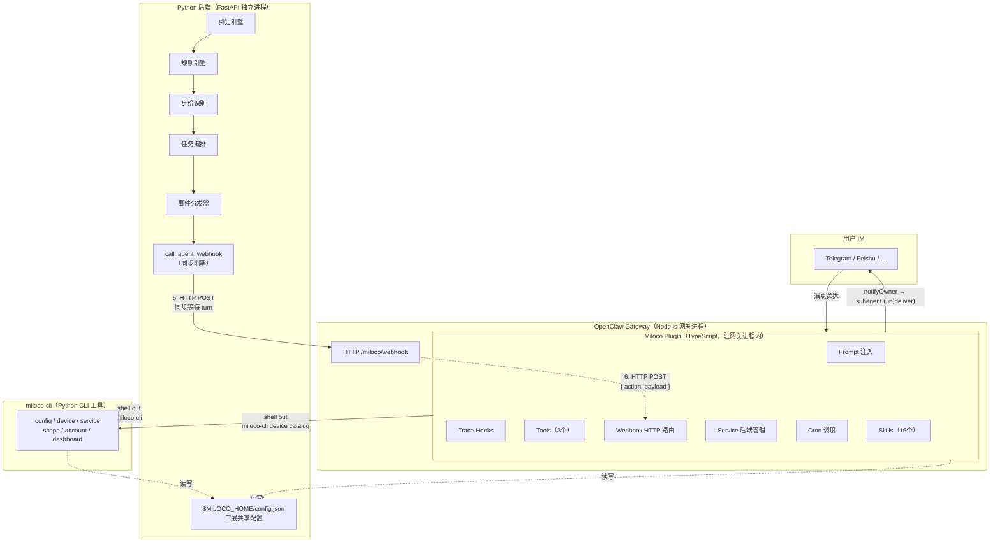
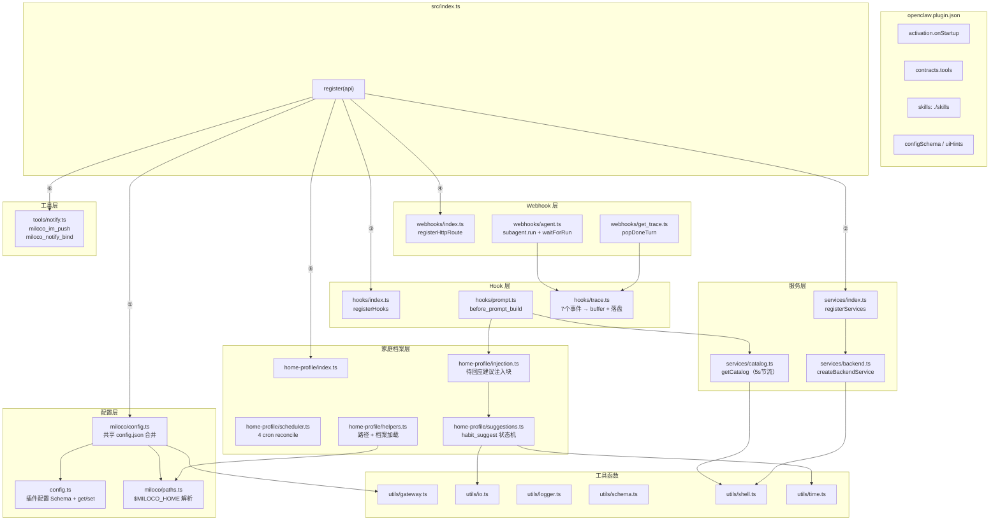
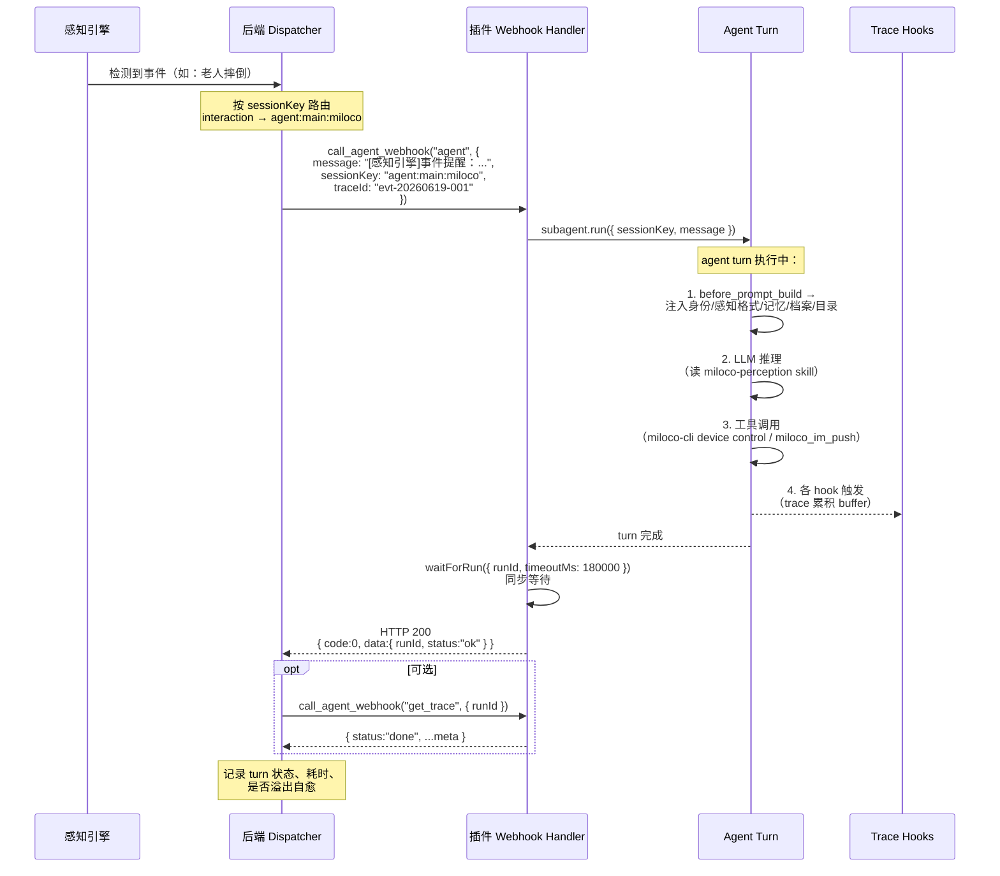
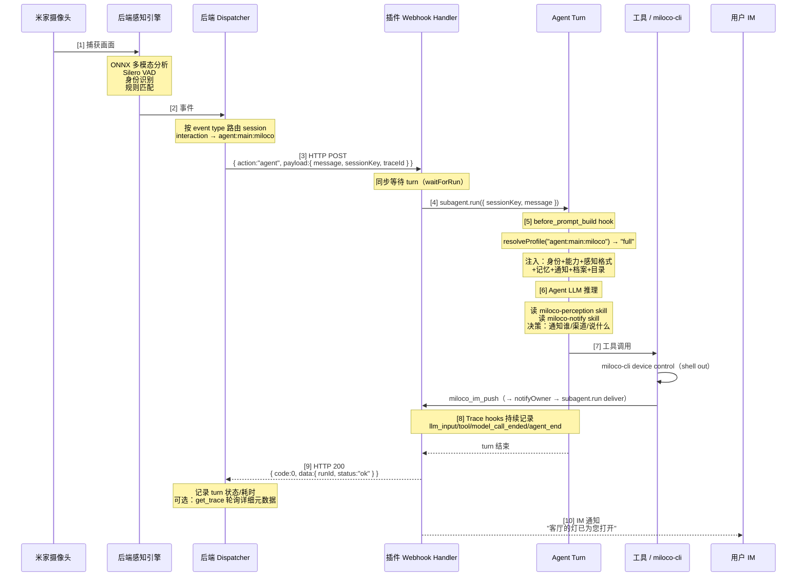

# OpenClaw 插件工作机制详解

> 本文档详尽描述 `plugins/openclaw/` 目录下 TypeScript 插件的完整运行机制，作为 Hermes Agent 插件移植的设计依据。

---

## 1. 三层架构总览



**核心设计原则**：插件是**薄适配层**，所有重计算（感知、规则、身份、任务）都在 Python 后端。插件只做四件事：注入上下文、注册工具、转发 webhook、调度定时任务。

### 1.1 插件模块架构



---

## 2. 插件入口与注册流程

### 2.1 清单文件 `openclaw.plugin.json`

```json
{
  "id": "miloco-openclaw-plugin",
  "name": "Miloco",
  "description": "Miloco for OpenClaw",
  "activation": { "onStartup": true },
  "hooks": { "allowConversationAccess": true },
  "contracts": {
    "tools": ["miloco_im_push", "miloco_notify_bind", "miloco_habit_suggest"]
  },
  "skills": ["./skills"],
  "configSchema": { ... },
  "uiHints": { ... }
}
```

| 字段 | 作用 |
|------|------|
| `activation.onStartup: true` | 网关启动时自动激活插件 |
| `hooks.allowConversationAccess: true` | 允许插件读取/修改对话上下文（prompt 注入必需） |
| `contracts.tools` | 声明插件提供的 3 个工具契约（与 skill 文档对应） |
| `skills: ["./skills"]` | 声明技能目录路径（构建时从 `plugins/skills/` 同步） |
| `configSchema` / `uiHints` | 用户配置页面（模型、API Key、通知渠道等） |

### 2.2 注册入口 `src/index.ts`

```typescript
export default {
  id: kPluginId, name: kPluginName, description: kPluginDescription,
  configSchema: MilocoPluginConfigSchema,
  register(api: OpenClawPluginApi) {
    logger.init(api);
    loadSharedConfig(api);      // ① 写盘副作用：合并 plugin 配置 + gateway 凭据 → config.json
    registerServices(api);     // ② 注册后端服务生命周期
    registerHooks(api);        // ③ 注册 prompt 注入 + trace hooks
    registerHttpRoutes(api);   // ④ 注册 webhook HTTP 路由
    registerHomeProfile(api);  // ⑤ 注册 cron 调度 + habit_suggest 工具
    registerNotifyTool(api);   // ⑥ 注册通知工具
  },
};
```

**注册顺序的隐含依赖**：

- ① 必须最先执行——`loadSharedConfig(api)` 把插件配置（debug、omni_*）和 gateway 鉴权信息（webhook_url、auth_bearer）写入 `$MILOCO_HOME/config.json`。这是**写盘副作用**（源码注释："看似不用返回值，实际依赖这个写盘副作用——别再删了"）。后端启动时（②）读这个文件才能拿到正确的 webhook 地址和鉴权 token。

- ② 在 ① 之后执行——`createBackendService` 调用 `miloco-cli service restart` 启动 Python 后端。此时 config.json 已就绪，后端能正确读到 webhook 地址。

---

## 3. 共享配置机制

### 3.1 三层共享的 `$MILOCO_HOME/config.json`

| 层 | 写入者 | 写入内容 |
|----|--------|---------|
| 插件 (TS) | `loadSharedConfig()` | `debug`、`model.omni.*`、`agent.webhook_url`、`agent.auth_bearer` |
| CLI (Python) | `miloco-cli config set` | `server.url`、`server.token`、`model.omni.api_key`、`scope.*` |
| 后端 (Python) | `ensure_backend_token()` / `update_shared_config()` | `server.token`（首次生成 UUID） |

**路径解析**（`miloco/paths.ts`）：

```typescript
function milocoHome(): string {
  const env = process.env.MILOCO_HOME;
  if (env && env.length > 0) {
    return env.startsWith("~") ? path.join(homedir(), env.slice(1)) : env;
  }
  return path.join(homedir(), ".openclaw", "miloco");  // 默认
}
```

后端 Python 侧 (`miloco.utils.paths.miloco_home()`) 和 CLI 侧 (`miloco_cli.config.miloco_home()`) 保持一致的解析逻辑。三层通过 `$MILOCO_HOME` 环境变量或默认路径 `~/.openclaw/miloco` 达成一致。

### 3.2 配置合并流程 `loadSharedConfig(api)`

```
磁盘 config.json（已存在）
    │
    ▼
读入 raw dict
    │
    ├── mergePluginIntoRaw(raw, pluginConfig)
    │     • pluginConfig.debug → raw.debug
    │     • pluginConfig.omni_model/omni_base_url/omni_api_key → raw.model.omni.*
    │
    ├── ensureAgentEssentials(raw, api)
    │     • raw.agent.webhook_url = `${gatewayUrl}/miloco/webhook`（若空）
    │     • raw.agent.auth_bearer = gateway 鉴权 token（从 gateway auth 配置解析）
    │
    ▼
序列化 JSON → 与磁盘对比 → 有变化才写盘（避免冗余 IO / mtime 抖动）
    │
    ▼
parseSharedConfig(raw) → 返回 schema 校验后的完整配置
```

**设计要点**：每次 `register()` 调用时执行一次。稳态下（配置不变）零写入；首次启动或用户手改格式时执行一次归一化写入。

### 3.3 插件配置 Schema

插件通过 OpenClaw 的 `configSchema` 暴露 5 个用户可配置字段：

| 字段 | 类型 | 说明 |
|------|------|------|
| `debug` | boolean | 调试模式（覆盖 config.json 顶层 debug） |
| `omni_model` | string | 多模态模型标识（覆盖 config.json model.omni.model） |
| `omni_base_url` | string | 多模态模型 Base URL |
| `omni_api_key` | string | 多模态模型 API Key |
| `notifySessionKey` | string | 通知目标 sessionKey |

这些字段在 `loadSharedConfig()` 中合并进 config.json 的对应路径。

---

## 4. 后端服务生命周期管理

### 4.1 服务注册 `services/index.ts` + `backend.ts`

```typescript
export const createBackendService: ServiceBuilder = () => ({
  id: "miloco-backend",
  start: async () => {
    const result = await runShell("miloco-cli", ["service", "restart"]);
    // 日志输出成功/失败
  },
  stop: async () => {
    const result = await runShell("miloco-cli", ["service", "stop"]);
    // 日志输出成功/失败
  },
});
```

**机制**：OpenClaw 插件 SDK 提供 `api.registerService(service)`，service 有 `start()` / `stop()` 生命周期回调。网关启动时调 `start()`，网关关闭时调 `stop()`。

**实际行为**：`start()` 调 `miloco-cli service restart`，CLI 内部：
1. 读 config.json 获取后端配置（端口、token、python 解释器）
2. 启动 `miloco-backend`（FastAPI + uvicorn）作为后台进程
3. 后端进程加载感知引擎、规则引擎等组件

插件**不直接管理进程**，而是委托给 `miloco-cli`。这是一个设计选择：CLI 负责进程管理的所有细节（PID 文件、端口绑定、健康检查），插件只做"调 CLI"的薄封装。

### 4.2 设备目录注入 `services/catalog.ts`

```typescript
// before_prompt_build hook 中调用
const catalog = await getCatalog();

async function getCatalog(): Promise<string> {
  // 5 秒节流：同一对话片段内多次 hook 调用只跑一次 CLI
  if (cached && now - cached.generatedAt < 5_000) return cached.text;

  const text = await runCliCatalog();  // miloco-cli device catalog, 10s 超时
  if (text == null) return cached?.text ?? "";  // 失败沿用旧缓存
  cached = { text, generatedAt: now };
  return text;
}
```

**CLI 内部**：`miloco-cli device catalog` 调后端 `GET /api/miot/device_history`，拿到最新 LRU snapshot + 读 `home_info.json`，输出格式化的 TSV-like 设备目录文本（≤50 台高频设备子集）。

**5 秒节流而非 mtime 缓存**：源码注释解释了不用 `home_info.json` 的 mtime 做缓存命中条件——LRU 变化在后端 SQLite 中，不改 mtime，用 mtime 判断会导致目录永远卡在缓存里。

---

## 5. Prompt 上下文注入（核心机制）

### 5.1 触发时机

OpenClaw 在每次构建 prompt 前触发 `before_prompt_build` 事件。插件注册的 hook 返回 `{ prependSystemContext, appendSystemContext }`，分别注入到 system prompt 的头部和尾部。

### 5.2 Session Profile 分级注入 `hooks/prompt.ts`

**核心设计**：不是所有 session 都需要完整上下文。按 session 类型分 4 级：

| Profile | 触发条件 | 注入内容 |
|---------|---------|---------|
| `full` | 默认（用户 IM 主会话、`agent:main:miloco`） | 全部：身份 + 能力 + 感知格式(3类) + 记忆 + 通知 + 语言 + 档案 + 待回应建议 + 设备目录 |
| `suggestion` | sessionKey 含 `miloco-suggest` | 身份 + 感知格式(仅事件提醒) + 记忆 + 通知 + 语言 + 档案 |
| `rule` | sessionKey 含 `miloco-rule` | 身份 + 感知格式(仅规则提醒) + 记忆 + 通知 + 语言 + 档案 |
| `minimal` | cron 任务（`trigger="cron"` 或 sessionKey 含 `:cron:`） | 仅身份 + 通知 + 语言（不注入感知/记忆/档案/目录） |

**Profile 判定逻辑**：

```typescript
export function resolveProfile(sessionKey, opts): Profile {
  // cron 一律走 minimal：它们只需各自 skill + CLI 自取数据，
  // 不该拿到主 agent 的能力/感知/通知人格
  if (opts?.trigger === "cron" ||
      opts?.prompt?.startsWith("[cron:") ||
      key.includes(":cron:") ||
      key.startsWith("cron:")) return "minimal";

  if (key.includes("miloco-rule")) return "rule";
  if (key.includes("miloco-suggest")) return "suggestion";
  return "full";
}
```

**设计意图**：定时任务（perception-digest、home-dreaming 等）是隔离的 cron agent。给它们完整上下文会导致"误把结合感知记忆和家庭档案主动提醒/操作当成自己的职责"。

### 5.3 注入内容详解

#### Prepend（指令块，静态文本）

按固定顺序拼接：

1. **`B_IDENTITY`** — 身份定义：
   > "你是经验丰富的家庭智能管家 Miloco。你能感知家中发生的事件，理解家庭成员的生活习惯，并据此做出贴心的行为或建议..."

2. **`B_CAPABILITIES`**（仅 full）— 能力概览：设备控制、实时感知、主动智能、任务编排、家庭记忆、成员识别

3. **`buildPerception(profile)`**（非 minimal）— 感知消息格式规范：
   - `voice`：语音提醒格式（header `[感知引擎]语音提醒：`，key:value 多段竖排，`═══` 分隔多条）
   - `suggestion`：事件提醒格式（header `[感知引擎]事件提醒：`）
   - `rule`：规则提醒格式（header `[感知引擎]规则提醒：`，三段 `---` 分隔：意图/处理流程/额外信息）
   - 包含去重、跨相机融合理解的指令

4. **`B_MEMORY`**（非 minimal）— 家庭记忆使用规范：
   > "做任何事之前，先查感知记忆（memory_search）和家庭档案..."
   > "用户实时指令 > 档案规则（除非明确标注为底线/红线）"

5. **`B_NOTIFY`** — 通知前置指令：
   > "要主动找人时——而不是当面回答用户此刻的提问——动手前必须先读 miloco-notify skill"

6. **`B_LANGUAGE`** — 语言指令：用用户使用的语言回复

#### Append（数据块，动态内容）

1. **家庭档案**（非 minimal）— 从 `$MILOCO_HOME/profile.md` 读取，注入时 Markdown 标题降一级（`#` → `##`），嵌进 system prompt 的 `##` 层级下。空档案不注入。

2. **待回应习惯建议**（仅 full）— 从 `$MILOCO_HOME/habit-suggestions.json` 读取 `status=asked` 且未过期的条目，注入格式化的待回应列表 + 处理指引（"若是肯定/否定语气 → 调用 resolve"）。正常日子完全静默。

3. **设备目录**（非 minimal）— 调 `getCatalog()` 获取，套 ```` ```text ```` 围栏（catalog 行首 `#` 是注释前缀而非 markdown 标题）。

### 5.4 注入位置

```typescript
return {
  prependSystemContext: prepend.join("\n\n"),
  appendSystemContext: append.length ? append.join("\n\n") : undefined,
};
```

注入到 **system prompt** 的首尾。这是 OpenClaw 特有的——Hermes 的 `pre_llm_call` hook 注入到 **user message**。

---

## 6. Webhook HTTP 路由（后端→Agent 回调）

### 6.1 路由注册 `webhooks/index.ts`

```typescript
api.registerHttpRoute({
  path: "/miloco/webhook",
  auth: "gateway",    // 使用 gateway 的 auth token 鉴权
  match: "exact",
  handler: async (req, res) => {
    const { action, payload } = await parseJsonBody(req);
    const webhook = kWebhooks[action];
    if (!webhook) { sendJson(res, 404, ...); return true; }
    const result = await webhook({ payload, api, config, req, res });
    sendJson(res, 200, ok(result));
    return true;
  },
});
```

**机制**：OpenClaw 插件 SDK 提供 `api.registerHttpRoute()`，在网关进程上注册 HTTP 路由。`auth: "gateway"` 表示用网关的 auth token 鉴权（后端在 config.json 中拿到这个 token）。

**请求格式**：`POST /miloco/webhook`

```json
{
  "action": "agent",
  "payload": {
    "message": "[感知引擎]事件提醒：\n时间：14:30:22\n来源：客厅摄像头(did=xxx)\n...",
    "sessionKey": "agent:main:miloco",
    "lane": "miloco-interactive",
    "traceId": "abc-123",
    "idempotencyKey": "abc-123",
    "timeoutMs": 180000
  }
}
```

**响应格式**：`{ code: 0, message: "ok", data: {...} }`

### 6.2 `agent` action — 同步执行 agent turn `webhooks/agent.ts`

**核心行为**：POST 一条消息到指定 session，**同步等待**该 turn 完成或超时，返回 turn 状态。

```typescript
action: async ({ api, payload }) => {
  const { message, sessionKey = "main", timeoutMs, idempotencyKey, traceId } = payload;

  // 1. 起 subagent run（不投递）
  const result = await api.runtime.subagent.run({
    sessionKey, message, lane,
    deliver: false,
    idempotencyKey,
    extraSystemPrompt,
  });

  // 2. trace 关联（traceId → runId，供 trace hooks 过滤）
  if (traceId) registerTraceLink(result.runId, traceId);

  // 3. 同步等待 turn 完成
  const wait = await api.runtime.subagent.waitForRun({ runId, timeoutMs });

  // 4. 上下文溢出自愈
  const overflowReason = await detectOverflow(runId, wait);
  if (overflowReason) {
    await api.runtime.subagent.deleteSession({ sessionKey, deleteTranscript: true });
    const retry = await runOnce(`${idempotencyKey}:retry`, retryWaitMs);
    return { runId: retry.runId, status: retry.wait.status, error: ..., recovered: !retryOverflow };
  }

  return { runId, status: wait.status, error: wait.error };
}
```

**关键细节**：

| 特性 | 说明 |
|------|------|
| **同步阻塞** | `waitForRun()` 阻塞直到 turn 完成（最多 timeoutMs，默认 180s）。后端在 HTTP 超时内拿到结果 |
| **幂等键** | `idempotencyKey` 防止 HTTP 真断后重试导致重复 turn |
| **上下文溢出自愈** | 检测到 context overflow 时，删除旧 session 重建，重试一次（不循环） |
| **trace 关联** | `registerTraceLink(runId, traceId)` 让 trace hooks 知道这是后端发起的 turn |

**后端如何调用**（`backend/miloco/src/miloco/utils/agent_client.py`）：

```python
async def run_agent_turn(text, *, session_key, lane, trace_id, wait_timeout_ms):
    """投递消息并同步等待 turn 结束，返回 (run_id, status, rtt_ms)"""
    data = await call_agent_webhook("agent", {
        "message": text,
        "sessionKey": session_key,
        "lane": lane,
        "traceId": trace_id,
        "idempotencyKey": trace_id,  # 批次稳定幂等键
        "timeoutMs": wait_timeout_ms,
    }, timeout=wait_timeout_ms/1000 + 15.0)  # HTTP 超时 > wait_timeout_ms
    return data.get("runId"), data.get("status"), rtt_ms
```

HTTP 超时 = `wait_timeout_ms/1000 + 15s` 缓冲。后端 dispatcher 依赖这个**同步阻塞语义**来确认 turn 结果。

### 6.3 `get_trace` action — 后端轮询 turn 元数据 `webhooks/get_trace.ts`

```typescript
action: ({ payload }) => {
  const { runId } = payload;
  const status = getTurnStatus(runId);  // "done" | "in_progress" | "unknown"
  if (status !== "done") return { status };
  const meta = popDoneTurn(runId);  // 返回 meta 并清除内存
  return { status: "done", ...meta };
}
```

**后端使用场景**：webhook `agent` action 返回后，后端用 `get_trace` 轮询获取 turn 的详细元数据（LLM 调用数、工具调用数、耗时分布、错误信息）。trace meta 在内存中保留 2 分钟（`DONE_TTL_MS = 120_000`）。

### 6.4 后端→插件完整数据流



---

## 7. Agent Turn Trace（全链路追踪）

### 7.1 追踪的事件 `hooks/trace.ts`

| OpenClaw 事件 | 触发时机 | 记录内容 |
|---------------|---------|---------|
| `llm_input` | LLM 调用前 | provider、model、systemPrompt、prompt、historyMessages、imagesCount |
| `before_tool_call` | 工具执行前 | toolName、params |
| `after_tool_call` | 工具执行后 | toolName、result、error、durationMs |
| `llm_output` | LLM 返回后 | provider、model、resolvedRef、assistantTexts、usage |
| `model_call_ended` | 模型调用结束 | provider、model、durationMs、outcome、errorCategory |
| `agent_end` | 主 agent turn 结束 | success、error、durationMs、messageCount |
| `subagent_ended` | 子 agent turn 结束 | outcome、error、endedAt、targetSessionKey |

### 7.2 Trace Buffer 管理

```
turns Map<runId, TurnState>
  TurnState = {
    buffer: RecordedEvent[],   // 最多 500 条
    query?: string,             // 提取的用户查询
    startedAt: number,
    done?: AgentMetaPayload,   // turn 结束后的元数据
    doneAt?: number,
  }
```

**GC 策略**：
- 已完成 turn 保留 2 分钟（`DONE_TTL_MS`），供 backend `get_trace` 来取
- 未结束 turn 15 分钟强制 evict（`STUCK_TTL_MS`）
- 硬上限 20 个 turn（`TURNS_HARD_CAP`），超出按最老优先删

### 7.3 落盘（Debug 模式）

```
$MILOCO_HOME/trace/agent/YYYYMMDD/<runId>__<query>.jsonl.gz
```

- Debug 标志：每 turn 现读 `$MILOCO_HOME/.debug_observability` 哨兵文件，运行时切换立即生效
- 每日上限 300 个 jsonl.gz（`DAILY_DUMP_MAX`），超出 warn 跳过
- 只落有 traceId 的 turn（无 traceId 的 cron / setup 等 turn 不落盘）

### 7.4 Trace 关联 `traceLinks` Map

```
registerTraceLink(runId, traceId)
  → traceLinks.set(runId, traceId)
  → 同时种入 turns 占位条目（防 backend 第一次 get_trace poll 在 llm_input 之前到达时 turns.get(runId) 为空）
```

**finalizeTurn** 在 `agent_end` 或 `subagent_ended` 时触发（两个都监听，靠 `state.done` 幂等去重）：

```
finalizeTurn(end):
  1. 等一个 event loop tick（setImmediate）——让 llm_output 的同步 push 完成
  2. popTraceLink(runId) 取 traceId
  3. reduceMeta(buffer) → 计算 llmCallCount/toolCallCount/llmTotalMs/toolTotalMs/...
  4. 若 debug → gzip 落盘
  5. state.done = { traceId, runId, query, durationMs, success, ...meta, jsonlPath }
  6. gcExpiredTurns()
```

---

## 8. 工具（3 个）

### 8.1 `miloco_im_push` — IM 通知推送

```typescript
parameters: Type.Object({
  message: Type.String({ description: "要发给主人的通知正文" }),
  bindHint: Type.Optional(Type.String({ description: "绑定引导语（仅 needsBind 时传）" })),
})
```

**核心逻辑** `notifyOwner(api, message, { bindHint })`：

1. `resolveNotifyTarget(api)` — 从 OpenClaw session store 解析通知目标：
   - 已配置 `notifySessionKey` 且有效 → 正常使用
   - 未配置或失效 → fallback 到最近活跃 channel，标记 `needsBind: true`

2. `needsBind && !bindHint` → **不发送**，返回 `needsBind: true` + `bindHintExample`。这是给 agent 的执行指令："立即再次调用，补上 bindHint，通知才会真正发送"

3. `needsBind && bindHint` → 把 bindHint 拼到正文后（`message\n---\nbindHint`），用 `<miloco-notification>` 标签包裹

4. `api.runtime.subagent.run({ sessionKey, message: deliverMessage, deliver: true, extraSystemPrompt })` — 起一个转发子 agent，extraSystemPrompt 指示它原样转发标签内文本

5. `waitForRun({ timeoutMs: 30_000 })` — 等待投递完成

**绑定引导语**：

| 场景 | bindHintExample |
|------|----------------|
| `not_configured` | "您尚未设置 Miloco 通知频道...回复「绑定通知频道」可将当前对话设为固定频道..." |
| `configured_but_invalid` | "您原先绑定的频道已失效...请回复「绑定通知频道」重新绑定。" |

### 8.2 `miloco_notify_bind` — 绑定通知渠道

```typescript
parameters: Type.Object({
  sessionKey: Type.Optional(Type.String({ description: "目标 session key，留空则使用当前对话" })),
})
```

从 OpenClaw session store 读取当前 session 的 `lastTo` / `lastChannel`，调 `setPluginConfig(api, { notifySessionKey })` 持久化。

### 8.3 `miloco_habit_suggest` — 习惯建议状态机

```typescript
parameters: Type.Object({
  action: Type.Union([Type.Literal("list"), Type.Literal("record"), Type.Literal("mark_asked"), Type.Literal("resolve")]),
  key, subject, habit, suggestion, title, evidence, item_id,  // record 用
  outcome, task_id, reason,  // resolve 用
})
```

**状态机**（`home-profile/suggestions.ts`）：

```
pending → asked → (accepted → created) | rejected | expired
```

| 状态 | 含义 | 是否终态 |
|------|------|---------|
| `pending` | 已识别入库、尚未询问 | 否 |
| `asked` | 已确认送达、等回应（占待回应位） | 否 |
| `accepted` | 用户同意、建任务中 | 否（中间态） |
| `created` | 任务已建 | **终态**，不再推荐 |
| `rejected` | 用户明确拒绝 | **终态**，永不再问 |
| `expired` | 无明确回应过期（7天） | 否（可复活重推，累计问满3次则永久放弃） |

**防骚扰闸门**（工具自身裁定，不依赖 agent 自觉）：

| 闸门 | 限制 |
|------|------|
| `MAX_OPEN_QUESTIONS` | 同一时刻至多 1 条待回应 |
| `MAX_NEW_ASK_PER_DAY` | 每日至多 1 条新推 |
| `STALE_DAYS` | asked 超 7 天无回应 → expired |
| `MAX_ASKS` | 累计至多主动询问 3 次，问满仍无果永久放弃 |

**并发控制**：进程内互斥（`withLock` Promise 链串行化）+ 原子写（temp→rename）。消除扫描 agent 和回应 agent 同进程并发竞态。

**数据存储**：`$MILOCO_HOME/habit-suggestions.json`（`{ version, entries: Suggestion[] }`）。

---

## 9. 定时任务调度

### 9.1 Cron 注册 `home-profile/scheduler.ts`

```typescript
const kCronTasks = [
  { name: "miloco-perception-digest", schedule: { expr: "*/15 * * * *" }, ... },
  { name: "miloco-home-patrol",       schedule: { expr: "*/30 * * * *" }, ... },
  { name: "miloco-home-dreaming",     schedule: { expr: "0 0 * * *" },   ... },
  { name: "miloco-habit-suggest",    schedule: { expr: "0 10 * * *" },  ... },
];
```

| 任务 | 频率 | 用途 | lightContext |
|------|------|------|--------------|
| perception-digest | 每15分钟 | 感知日志摘要/压缩 | true |
| home-patrol | 每30分钟 | 家庭记忆/习惯巡检 | false（需完整上下文） |
| home-dreaming | 每天0点 | Observe→Promote→Prune 三步 | true |
| habit-suggest | 每天10点 | 习惯洞察→推荐建任务 | true |

**reconcile 机制**（`gateway_start` 时执行）：

```
1. list 现有 cron jobs
2. 过滤 managed（description 含 "[miloco:home-profile]" tag）
3. 对每个 kCronTask：不存在则 add，存在则 update
4. 清理不在 kCronTasks 列表中的 managed jobs
```

**teardown**（`gateway_stop` 时执行）：删除所有 managed cron jobs。

### 9.2 Cron Payload 格式

```typescript
payload: {
  kind: "agentTurn",          // 起一个 agent turn
  lightContext: true/false,   // 轻量上下文（对应 prompt profile 的 minimal）
  message: "执行感知日志摘要。加载 miloco-perception-digest skill 进行处理。",
  sessionTarget: "isolated",  // 隔离 session（不复用主会话上下文）
  delivery: { mode: "none" }, // 不投递给用户（内部任务）
  wakeMode: "now",
}
```

**isolated session** 的关键含义：cron agent **不共享主会话上下文**。它们通过各自的 skill + CLI 自取数据完成工作。这是 `resolveProfile()` 将 cron 一律判为 `minimal` 的原因。

---

## 10. Skills（16 个技能文档）

### 10.1 打包方式

```
plugins/skills/          ← 源目录（16 个 skill 目录）
  ├── miloco-devices/
  │   └── SKILL.md
  ├── miloco-perception/
  │   └── SKILL.md
  └── ...

plugins/openclaw/scripts/sync-skills.mjs  ← prebuild 脚本
  复制 plugins/skills/ → plugins/openclaw/skills/

plugins/openclaw/openclaw.plugin.json
  "skills": ["./skills"]  ← 清单指向打包后的目录
```

构建时 `prebuild` 执行 `sync-skills.mjs`，把源 skills 同步到插件目录。OpenClaw 发现清单中的 `"skills"` 字段后自动加载。

### 10.2 Skill 分类

| 类别 | Skills | 用户可见 |
|------|--------|---------|
| 设备控制 | miloco-devices | ✓ |
| 感知 | miloco-perception, miloco-perception-digest(内部) | 部分 |
| 身份 | miloco-miot-identity, miloco-miot-identity-register | ✓ |
| 范围 | miloco-miot-scope | ✓ |
| 运维 | miloco-miot-admin | ✓ |
| 任务 | miloco-create-task, miloco-terminate-task | ✓ |
| 通知 | miloco-notify | ✓ |
| 家庭档案 | miloco-home-profile | ✓ |
| 家庭记忆 | miloco-home-observe(内部), miloco-home-promote(内部), miloco-home-prune(内部), miloco-home-patrol(内部) | 部分 |
| 习惯 | miloco-habit-suggest(内部) | 部分 |

### 10.3 Skill 加载机制

Skills 在系统提示中以 `<available_skills>` 索引列出。Agent 按需通过 `skill_view("<skill-name>")` 加载。加载后 skill 的完整内容（YAML frontmatter + Markdown body）进入 prompt 上下文。

---

## 11. 后端 Dispatcher 的路由逻辑

后端的 `dispatch/dispatcher.py` 按 event type 路由到不同 session：

```python
# backend/miloco/src/miloco/dispatch/dispatcher.py:41
"interaction": ("agent:main:miloco", "miloco-interactive", 0),  # 主会话
# rule → miloco-rule session
# suggestion → miloco-suggest session
```

| Event 类型 | SessionKey | Lane | 说明 |
|-----------|------------|------|------|
| `interaction` | `agent:main:miloco` | `miloco-interactive` | 语音交互/主动提醒 → 主会话（full profile） |
| `rule` | `miloco-rule:*` | — | 规则触发 → 规则会话（rule profile） |
| `suggestion` | `miloco-suggest:*` | — | 事件提醒 → 建议会话（suggestion profile） |

**单飞调度**：后端 dispatcher 保证同一 session 至多 1 个在途 turn（通过 `idempotencyKey` + webhook 的同步语义）。

---

## 12. 完整数据流：从感知事件到设备控制



---

## 13. OpenClaw SDK API 使用清单

| API | 文件 | 用途 |
|-----|------|------|
| `api.registerService(service)` | services/index.ts | 后端生命周期管理（start/stop） |
| `api.on("before_prompt_build", handler)` | hooks/prompt.ts | 上下文注入（prepend + append） |
| `api.on("gateway_start" / "gateway_stop")` | home-profile/scheduler.ts | cron reconcile / teardown |
| `api.on("llm_input" / "before_tool_call" / "after_tool_call" / "llm_output" / "model_call_ended" / "agent_end" / "subagent_ended")` | hooks/trace.ts | 全链路追踪 |
| `api.registerHttpRoute({ path, auth, match, handler })` | webhooks/index.ts | 后端回调 HTTP 路由 |
| `api.registerTool(factory, { name })` | tools/notify.ts, home-profile/suggestions.ts | 3 个工具注册 |
| `api.runtime.subagent.run({ sessionKey, message, ... })` | webhooks/agent.ts, tools/notify.ts | 起子 agent turn |
| `api.runtime.subagent.waitForRun({ runId, timeoutMs })` | webhooks/agent.ts, tools/notify.ts | 同步等待 turn 完成 |
| `api.runtime.subagent.deleteSession({ sessionKey })` | webhooks/agent.ts | 上下文溢出自愈 |
| `api.runtime.agent.session.resolveStorePath()` | tools/notify.ts | 解析 session store 路径 |
| `api.runtime.agent.session.loadSessionStore()` | tools/notify.ts | 加载 session store（查通知目标） |
| `api.runtime.config.mutateConfigFile({ mutate })` | config.ts | 持久化插件配置 |
| `resolveGatewayAuth({ authConfig, env })` | miloco/config.ts | 解析 gateway 鉴权 token |
| `resolveGatewayUrl(api)` | miloco/config.ts | 解析 gateway URL |

---

## 14. 关键设计决策汇总

| 决策 | 理由 |
|------|------|
| **薄适配层**：插件只做上下文注入/工具注册/webhook 转发，重计算在后端 | TypeScript 插件不适合做感知/规则等计算密集任务；后端 Python 已有完整实现 |
| **Shell out 到 miloco-cli**：设备目录、后端管理都调 CLI | CLI 是 Python 已有的完整实现，避免在 TS 中重写 |
| **共享 config.json**：三层读写同一文件 | 避免配置分散、保持一致性；atomic write 防并发损坏 |
| **Profile 分级注入**：按 session 类型注入不同上下文 | 避免给 cron agent 完整上下文导致职责混乱；减少 token 消耗 |
| **Webhook 同步语义**：waitForRun 阻塞返回 turn 状态 | 后端 dispatcher 依赖同步结果做单飞调度和状态跟踪 |
| **Trace 关联**：traceId → runId 映射 | 过滤出后端发起的 turn，排除 cron/setup 等无关 turn |
| **通知绑定状态机**：needsBind + bindHint 机制 | 绑定引导由 agent 按用户语言生成，工具自身裁定防骚扰规则 |
| **Cron isolated session**：不复用主会话上下文 | 隔离的 cron agent 只需各自 skill + CLI 自取数据 |
