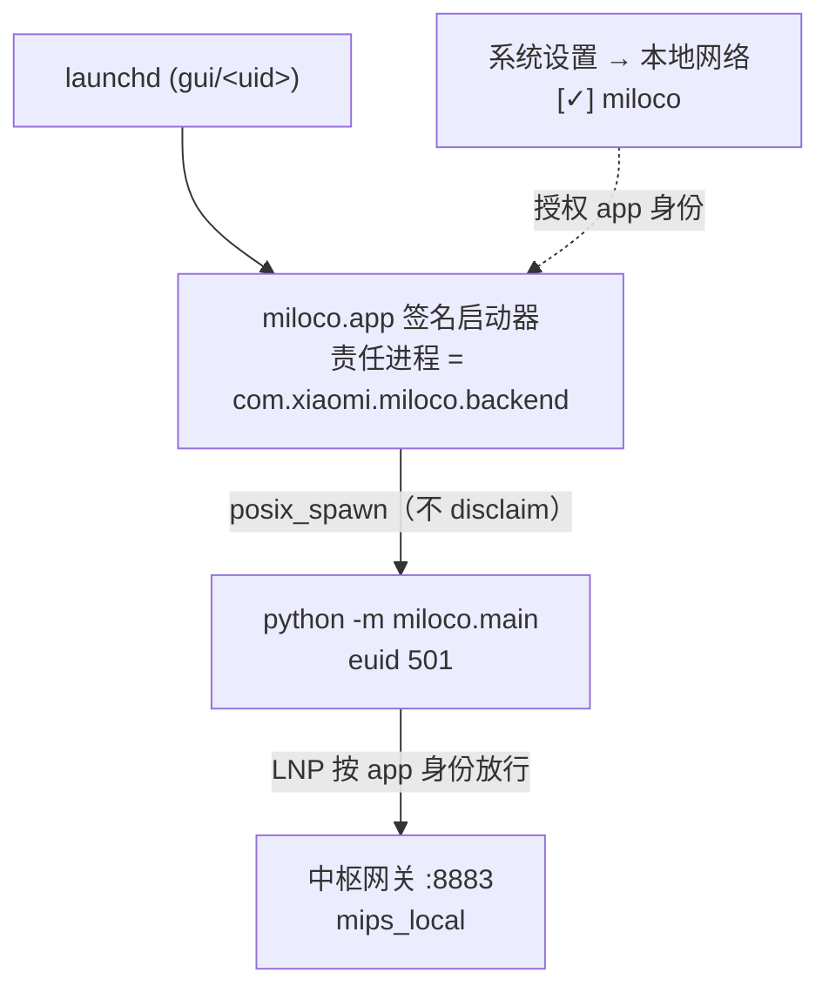
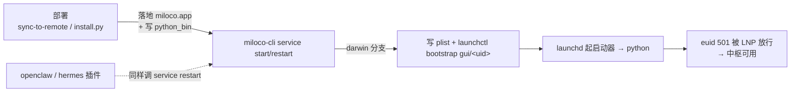

# macOS LaunchAgent + 签名启动器（绕过 Local Network Privacy）

## 问题

macOS 的 Local Network Privacy（LNP）会拦截**用户态进程访问局域网设备**。miloco 后端以普通用户身份运行，它**连接中枢网关的 TCP 会被拦**，报 `[Errno 65] No route to host`——只有 root 例外。结果：本地中枢在 mac 上连不上网关。

> **euid**：进程的有效用户 ID，代表其权限身份，`0` 即 root。
> **TCC**（Transparency, Consent & Control）：macOS 的隐私授权框架，按发起访问的**责任进程的代码签名身份**记录用户对某类资源（相机 / 麦克风 / 本地网络…）的授权。root（euid 0）天然绕过 TCC，所以只有 root 能直连；普通用户（euid≠0）必须先拿到"本地网络"授权。

## 方案核心

让 python 后端作为一个**带独立签名身份的 app（`com.xiaomi.miloco.backend`）的子进程**运行。macOS 会把子进程的本地网络访问**归属到这个 app**，给该 app 授权一次即放行。授权按 app 的代码签名身份记录：不影响其它 python 进程，且跨重启 / 发版 / 重装持久。

macOS 上用 **launchd 完全替代 supervisord** 管理后端进程（见下节）；Linux 不受影响，仍用 supervisord。

## 运行架构

## launchd 如何替代 supervisord

**唯一替换点**：`cli/src/miloco_cli/commands/service.py`。命令入口按平台选路——`_use_launchd() = (sys.platform=='darwin')` 为真则走 launchd 实现，否则走原 supervisord 实现。**没有第二处判断**：openclaw / hermes 插件、install.py、人工命令**全部经 `miloco-cli service`**，所以它们在 mac 上自动、透明地用上 launchd，调用方无感。

**supervisord 在 mac 被屏蔽的地方**：`install.py` 的 darwin 分支不再 `uv tool install supervisor`，改装签名启动器；darwin 不生成 `supervisord.conf`，也不产生 `supervisord.pid/.sock`。（Linux 分支一切照旧。）

**从老版(supervisord)升级的迁移**：darwin 的 `service start/restart/stop/kill` 会先 `_reap_legacy_supervisord()`——reap 残留 supervisord 守护进程（其 autorestart 的 backend 否则占着端口让 launchd 起不来）并清掉老 `supervisord.conf/.pid/.sock`。install.py / openclaw 都经 `miloco-cli service`，所以升级时自动迁移、无需手动 `pkill`。无残留时是 no-op。

**替代是全功能的**——主生命周期逐项对齐，且多拿到"登录自启"：

| 功能       | supervisord（Linux）                                                 | launchd（macOS）                                                                                          |
| ---------- | -------------------------------------------------------------------- | --------------------------------------------------------------------------------------------------------- |
| 管理器配置 | 内联生成 `~/.openclaw/miloco/supervisord.conf`                       | 生成 `~/Library/LaunchAgents/com.xiaomi.miloco.backend.plist`                                             |
| 启动       | `supervisord -c conf`（守护进程双 fork）→ `[program:miloco-backend]` | `launchctl bootstrap gui/<uid> plist` → 启动器 → python                                                   |
| 停止       | `supervisorctl shutdown` + reap 残留                                 | `launchctl bootout gui/<uid>/<label>`                                                                     |
| 重启       | `supervisorctl restart`                                              | bootout + bootstrap（`_launchd_reload`）                                                                  |
| 保活       | `autorestart=true` + `startretries=3`                                | `KeepAlive={SuccessfulExit:false}`（非 0 退出码 或 信号崩溃 都重拉，clean exit(0) 不拉）                  |
| 状态       | `supervisorctl status` 解析 RUNNING/pid                              | `launchctl print` 解析 pid，回退按端口反查                                                                |
| 就绪判定   | 轮询 `/health`（30s）                                                | 同（复用 `_wait_for_health`）                                                                             |
| 日志       | `stdout_logfile` + `redirect_stderr` → `miloco-backend.log`          | `StandardOutPath/StandardErrorPath` → 同一文件                                                            |
| 环境注入   | `environment=MILOCO_SUPERVISED=1,MILOCO_HOME=…`                      | `EnvironmentVariables={…}`，**额外补 `HOME`/`PATH`**（launchd 不继承 shell 环境，后端要 shell 调 ffmpeg） |
| 登录自启   | ✗（supervisord 本身需被 openclaw 每次拉起）                          | ✓（`RunAtLoad` + plist 常驻 LaunchAgents，登录即起）                                                      |
| 运行时文件 | conf / pid / sock                                                    | 仅 plist                                                                                                  |

**两点行为差异（非功能缺失）**：

- launchd 无 supervisord 的 unix socket 控制通道；`startretries=3→FATAL` 换成 `KeepAlive={SuccessfulExit:false}` + launchd ~10s 节流。launchd 本身无"放弃"态,但 CLI 侧 `service start/restart` 会在健康探测窗口内检测 crashloop(反复换 pid ≥3 次)并 `bootout` 停掉、报失败,补上"放弃"语义。
- `stop`（bootout）后 plist 仍留在 `~/Library/LaunchAgents`，**下次登录会因 `RunAtLoad` 再被拉起**（supervisord 的 stop 则一直停到手动再起）。对"应常驻的服务"这是期望行为。

## 部署 / 拉起流程

**openclaw / hermes 运行时无需改**：都调 `miloco-cli service`，darwin 分支翻成 `launchctl`、驱动同一 LaunchAgent、不打架（责任进程恒为启动器自身，与谁触发无关）。唯一改动是 `install-hermes.sh --diagnose` 的后端检查——从硬编码 `pgrep supervisord` 改走 `miloco-cli service status`（跨平台，mac 下不误报）。

## 组件

| 组件         | 位置                                       | 职责                                                                                                                                                                     |
| ------------ | ------------------------------------------ | ------------------------------------------------------------------------------------------------------------------------------------------------------------------------ |
| 签名启动器   | `launcher/src/miloco_launcher.c`           | 通用 C stub：`posix_spawn(argv[1:])` + 转发信号 + 以子退出码退出。**无 miloco 逻辑 → 字节稳定 → cdhash 稳定 → 授权持久**                                                 |
| app 包       | `launcher/darwin/miloco.app`               | 通用二进制（arm64+x86_64）+ Info.plist（`com.xiaomi.miloco.backend`），adhoc 签名后**入库**（`.gitattributes` 标 binary）。**文件名 `miloco.app` = 授权项标签 "miloco"** |
| launchd 管理 | `cli/.../commands/service.py`              | darwin 分支：生成 plist，start/stop/restart/status/kill 走 `launchctl`                                                                                                   |
| 打包         | `scripts/build.sh`                         | `build_miloco_launcher`（打 tar）+ `pack_platform_bundles`（darwin 归档含 launcher，供 release 安装）                                                                    |
| 部署         | `scripts/sync-to-remote.sh` / `install.py` | darwin 落地 app 到 `miloco_home()/miloco.app`、跳过 supervisor                                                                                                           |

## 关键取舍与坑

- **授权一次性**：headless agent 弹不出授权框，首次可能需在**系统设置 → 隐私与安全性 → 本地网络**给 "miloco" 打勾。
- **授权持久**：app 字节稳定 → cdhash 稳定 → 跨重启 / 发版 / 完整重装不重置。**重编 stub（字节变→cdhash 变）才需重新打勾**；adhoc 签名，不上长期证书。
  - 重编后清旧授权有坑：`tccutil reset LocalNetwork` / 重启 nehelper / CLI `rm` 掉 app **都清不掉**那条绑旧 cdhash 的陈旧条目（授权存 nehelper 内部、无官方 CLI reset）。**正解：在访达里把 `miloco.app` 拖进垃圾桶并清空**（触发 macOS 清掉本地网络条目），再重装 → 出现全新条目 → 勾选即通。或直接重启 mac。要彻底免此坑走长期自签证书（DR 绑证书非 cdhash）。
- **EIO 竞态**：`bootout` 后立刻 `bootstrap` 会报 `Bootstrap failed: 5: Input/output error`；`_launchd_reload` 须**轮询到 job 消失再 bootstrap + 有限重试**。
- **交叉编译**：Linux 构建端只 `tar` 已签名的 vendored app（不编译）；app 需在 mac 上编译签名一次后入库。
